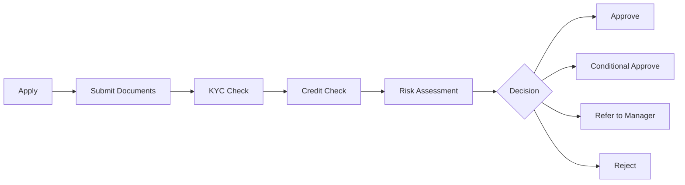

# Loan Application Process

This page stores **procedural knowledge** – the steps a bank follows from application to decision.

## Steps
1. **Apply** – applicant chooses the loan type and amount and fills the application.
2. **Submit documents** – KYC, income proof and loan-specific documents.
3. **KYC check** – bank verifies identity and address as per RBI rules.
4. **Credit check** – bank pulls the credit report and score from a credit bureau.
5. **Risk assessment** – bank checks income, FOIR, job stability, age and collateral.
6. **Decision** – Approve, Conditional Approve, Refer to manager, or Reject.
7. **Communication** – applicant is informed; if rejected, the main reasons are shared in writing.
8. **Disbursement** – after signing the agreement (and registering collateral where needed), money is released.

**Knowledge Type:** Procedural
